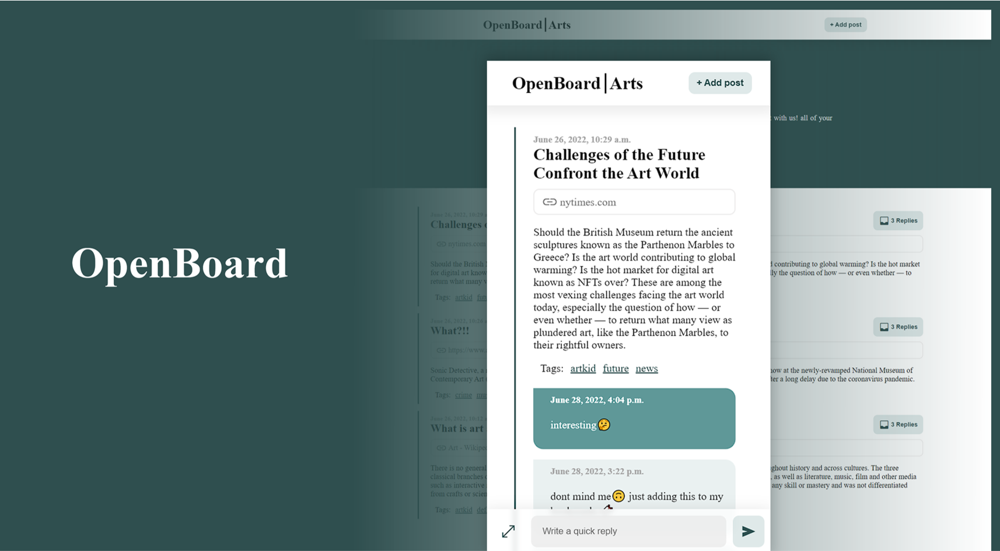

# OpenBoard

An open place to share

License: MIT

OpenBoard is a Django plugable app for adding a forum-like experience to any website. It doesn't use any third-party plugins nor does it use any frontend libraries. Everything is done through Django, Django templates, and CSS (although the project structure allows for extendibility). 
For deploying OpenBoard as a standalone app cookiecutter-Django is used to make the deployment process easier. 

Demo: [OpenBoard in action](https://openboarddemo.herokuapp.com/) (database will be wiped periodically)

## Implemented:
- Index page and its customizations settings
- Board page and its settings
- Tagging system that allows users to create and query tags and add them to their posts
- Manage what tags can be shown in the header
- Quick-reply for writing short replies and a dedicated reply page for longer ones
- A dedicated page for posting with complete form validation
- Form URL fields automatically fetch URL title to show in the post
- Complete frontend made with Django templates and pure CSS

## ToDo
- Unit tests for Board app
- Authentication
- Captcha
- Dedicated doc page (the code is commented pretty well)

This is a work in progress and not complete, please don't use it in production

I have used Django before here and there but never have I found the time to make a full-on website from start to the end. This project is the first one and I thought why not make it public. Don't hesitate to ask me any question or give me advice whether here or on my email : emamiarian8@gmail.com

### Type checks

Running type checks with mypy:

    $ mypy openboard

### Test coverage

To run the tests, check your test coverage, and generate an HTML coverage report:

    $ coverage run -m pytest
    $ coverage html
    $ open htmlcov/index.html

#### Running tests with pytest

    $ pytest

## Deployment

The following details how to deploy this application.

### Heroku

See detailed [cookiecutter-django Heroku documentation](http://cookiecutter-django.readthedocs.io/en/latest/deployment-on-heroku.html).

### Docker

See detailed [cookiecutter-django Docker documentation](http://cookiecutter-django.readthedocs.io/en/latest/deployment-with-docker.html).
